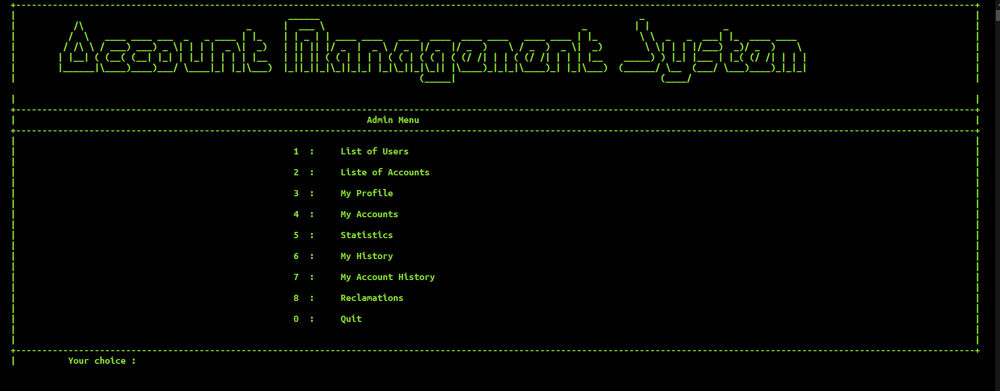
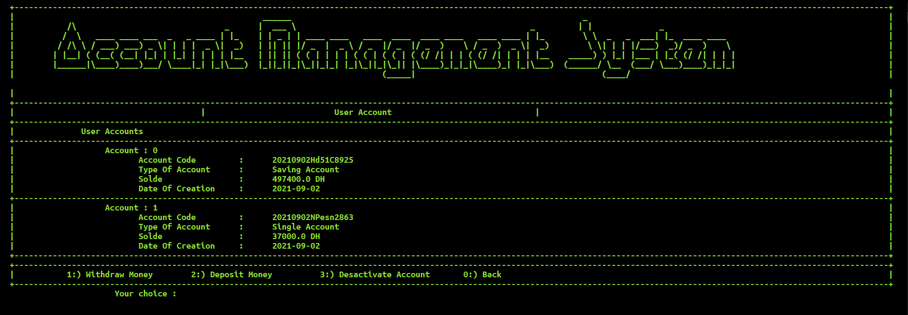

# Account System Management

**Version 1.0.0**s

This project is java console application, it is about banking account managing, it has several operations like in bank such as withdrawing or depositing some amount of money ,and also it has authentication system and some statistiques and etc .. 

it is writing with java and the data is saved withing files 

---
### Prequisites
Java 8 or higher

---
### Some Pictures

Admin Home Page

List Of Users

List Of Accounts

My Accounts

My Account History

My History

My Profile

User Menu

---
### Licence & copyright 
© Ismail Bouaddi, 2021